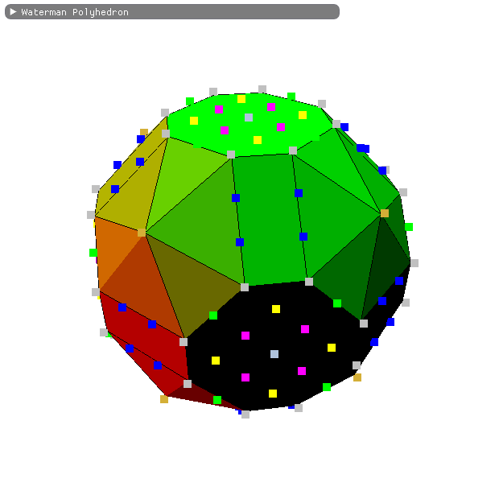
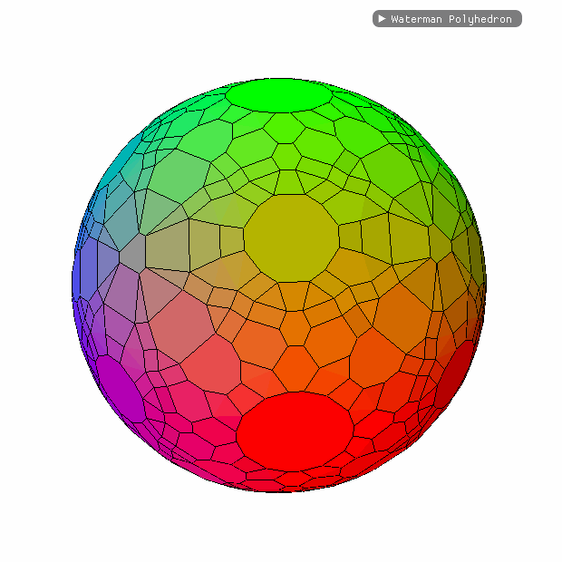
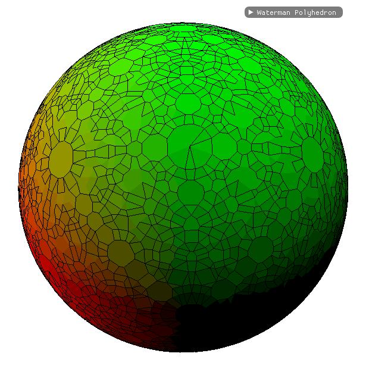

<!-- TABLE OF CONTENTS -->
<details open="open">
  <summary><h2 style="display: inline-block">Table of Contents</h2></summary>
  <ol>
    <li>
      <a href="#about-the-project">About The Project</a>
      <ul>
        <li><a href="#examples">Examples</a></li>
      </ul>
    </li>
    <li>
      <a href="#getting-started">Getting Started</a>
      <ul>
        <li><a href="#prerequisites">Prerequisites</a></li>
        <li><a href="#installation">Installation</a></li>
      </ul>
    </li>
    <li><a href="#3rd-party">3rd Party</a></li>
  </ol>
</details>


<!-- ABOUT THE PROJECT -->
## About The Project

Simple tool to create and preview Waterman Polyhedra / Spheres.


### Examples
| Root             |  Preview |
:-------------------------:|:-------------------------:
24|  
100|  
645|  
10000|  

<!-- Install -->
## Getting Started

To get a local copy up and running follow these simple steps.

### Prerequisites

None

### Installation

1. Clone the repo
   ```sh
   git clone
   ```
2. Submodules
   ```sh
   git submodule update --init --recursive
   ```
3. Build
  ```sh
  cd path/to/waterman && mkdir build && cd build && cmake .. && make -j4
   ```
4. Copy the resources folder to your executable

<!-- 3rd Party -->
## 3rd Party

| Project             |  License | Link|
:-------------------------:|:-------------------------:|:-------------------------:
imGui| MIT | https://github.com/ocornut/imgui/blob/master/LICENSE.txt
stb|  MIT | https://github.com/nothings/stb/blob/master/LICENSE
glm| MIT | https://github.com/g-truc/glm/blob/master/copying.txt
glfw| zlib | https://github.com/glfw/glfw/blob/master/LICENSE.md
glew-cmake| MIT | https://github.com/Perlmint/glew-cmake/blob/master/LICENSE.txt
easy-qhull| MIT | https://github.com/yuki-koyama/easy-qhull/blob/master/LICENSE
